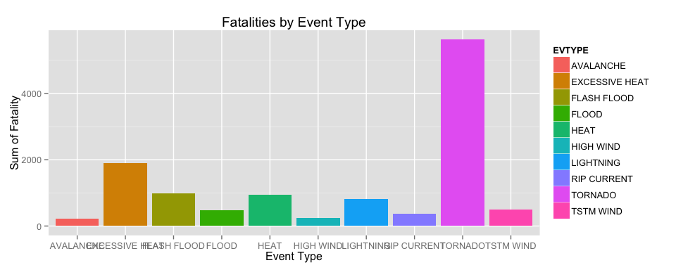
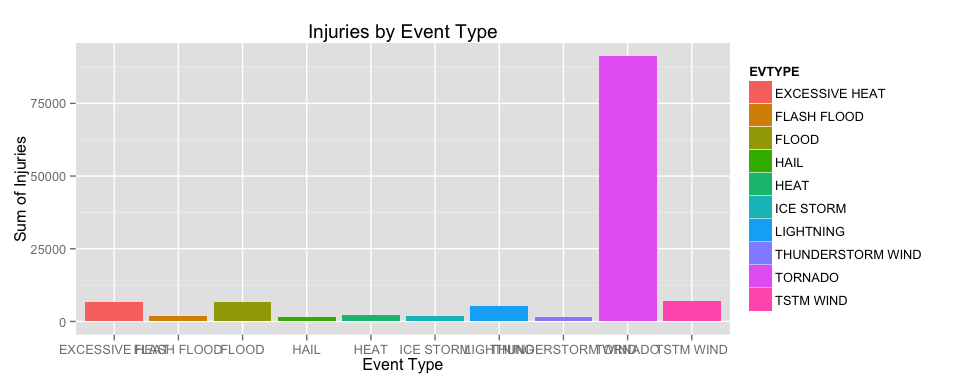

# Reproducible Research: Peer Assessment 2
#Storm events, from the U.S. National Oceanic and Atmospheric Administration's (NOAA) storm database, the **economic** and **human health impacts** from 1950.  

Kevin Dysart  
December 27th, 2015  

##Call the appropriate packages.  
For this assignment I will be utlizing the dplyr, knitr, grid, gridExtra and ggplot2 packages.

```r
library("dplyr")
```

```
## 
## Attaching package: 'dplyr'
## 
## The following objects are masked from 'package:stats':
## 
##     filter, lag
## 
## The following objects are masked from 'package:base':
## 
##     intersect, setdiff, setequal, union
```

```r
library("ggplot2")
library("grid")
library("knitr")
library("gridExtra")
library("lattice")
```

##Synopsis
Contained herein is an analysis of the financial and human health realated impact of storm events in the United States. The analysis utilizes the U.S. National Oceanic and Atmospheric Administration's (NOAA) storm database.

##Data Processing
After assigning the original dataset to an R object my usual first step is to simply look at the first 6 rows and call summary() and str() on the whole set to look for missing values amongst the variables.

```r
StormData <- read.csv("~/Desktop/OneDrive/R Working Directory/Reproducible_Research/Programming_Assignment_2/repdata-data-StormData.csv")
summary(StormData)
```

```
##     STATE__                  BGN_DATE             BGN_TIME     
##  Min.   : 1.0   5/25/2011 0:00:00:  1202   12:00:00 AM: 10163  
##  1st Qu.:19.0   4/27/2011 0:00:00:  1193   06:00:00 PM:  7350  
##  Median :30.0   6/9/2011 0:00:00 :  1030   04:00:00 PM:  7261  
##  Mean   :31.2   5/30/2004 0:00:00:  1016   05:00:00 PM:  6891  
##  3rd Qu.:45.0   4/4/2011 0:00:00 :  1009   12:00:00 PM:  6703  
##  Max.   :95.0   4/2/2006 0:00:00 :   981   03:00:00 PM:  6700  
##                 (Other)          :895866   (Other)    :857229  
##    TIME_ZONE          COUNTY           COUNTYNAME         STATE       
##  CST    :547493   Min.   :  0.0   JEFFERSON :  7840   TX     : 83728  
##  EST    :245558   1st Qu.: 31.0   WASHINGTON:  7603   KS     : 53440  
##  MST    : 68390   Median : 75.0   JACKSON   :  6660   OK     : 46802  
##  PST    : 28302   Mean   :100.6   FRANKLIN  :  6256   MO     : 35648  
##  AST    :  6360   3rd Qu.:131.0   LINCOLN   :  5937   IA     : 31069  
##  HST    :  2563   Max.   :873.0   MADISON   :  5632   NE     : 30271  
##  (Other):  3631                   (Other)   :862369   (Other):621339  
##                EVTYPE         BGN_RANGE           BGN_AZI      
##  HAIL             :288661   Min.   :   0.000          :547332  
##  TSTM WIND        :219940   1st Qu.:   0.000   N      : 86752  
##  THUNDERSTORM WIND: 82563   Median :   0.000   W      : 38446  
##  TORNADO          : 60652   Mean   :   1.484   S      : 37558  
##  FLASH FLOOD      : 54277   3rd Qu.:   1.000   E      : 33178  
##  FLOOD            : 25326   Max.   :3749.000   NW     : 24041  
##  (Other)          :170878                      (Other):134990  
##          BGN_LOCATI                  END_DATE             END_TIME     
##               :287743                    :243411              :238978  
##  COUNTYWIDE   : 19680   4/27/2011 0:00:00:  1214   06:00:00 PM:  9802  
##  Countywide   :   993   5/25/2011 0:00:00:  1196   05:00:00 PM:  8314  
##  SPRINGFIELD  :   843   6/9/2011 0:00:00 :  1021   04:00:00 PM:  8104  
##  SOUTH PORTION:   810   4/4/2011 0:00:00 :  1007   12:00:00 PM:  7483  
##  NORTH PORTION:   784   5/30/2004 0:00:00:   998   11:59:00 PM:  7184  
##  (Other)      :591444   (Other)          :653450   (Other)    :622432  
##    COUNTY_END COUNTYENDN       END_RANGE           END_AZI      
##  Min.   :0    Mode:logical   Min.   :  0.0000          :724837  
##  1st Qu.:0    NA's:902297    1st Qu.:  0.0000   N      : 28082  
##  Median :0                   Median :  0.0000   S      : 22510  
##  Mean   :0                   Mean   :  0.9862   W      : 20119  
##  3rd Qu.:0                   3rd Qu.:  0.0000   E      : 20047  
##  Max.   :0                   Max.   :925.0000   NE     : 14606  
##                                                 (Other): 72096  
##            END_LOCATI         LENGTH              WIDTH         
##                 :499225   Min.   :   0.0000   Min.   :   0.000  
##  COUNTYWIDE     : 19731   1st Qu.:   0.0000   1st Qu.:   0.000  
##  SOUTH PORTION  :   833   Median :   0.0000   Median :   0.000  
##  NORTH PORTION  :   780   Mean   :   0.2301   Mean   :   7.503  
##  CENTRAL PORTION:   617   3rd Qu.:   0.0000   3rd Qu.:   0.000  
##  SPRINGFIELD    :   575   Max.   :2315.0000   Max.   :4400.000  
##  (Other)        :380536                                         
##        F               MAG            FATALITIES          INJURIES        
##  Min.   :0.0      Min.   :    0.0   Min.   :  0.0000   Min.   :   0.0000  
##  1st Qu.:0.0      1st Qu.:    0.0   1st Qu.:  0.0000   1st Qu.:   0.0000  
##  Median :1.0      Median :   50.0   Median :  0.0000   Median :   0.0000  
##  Mean   :0.9      Mean   :   46.9   Mean   :  0.0168   Mean   :   0.1557  
##  3rd Qu.:1.0      3rd Qu.:   75.0   3rd Qu.:  0.0000   3rd Qu.:   0.0000  
##  Max.   :5.0      Max.   :22000.0   Max.   :583.0000   Max.   :1700.0000  
##  NA's   :843563                                                           
##     PROPDMG          PROPDMGEXP        CROPDMG          CROPDMGEXP    
##  Min.   :   0.00          :465934   Min.   :  0.000          :618413  
##  1st Qu.:   0.00   K      :424665   1st Qu.:  0.000   K      :281832  
##  Median :   0.00   M      : 11330   Median :  0.000   M      :  1994  
##  Mean   :  12.06   0      :   216   Mean   :  1.527   k      :    21  
##  3rd Qu.:   0.50   B      :    40   3rd Qu.:  0.000   0      :    19  
##  Max.   :5000.00   5      :    28   Max.   :990.000   B      :     9  
##                    (Other):    84                     (Other):     9  
##       WFO                                       STATEOFFIC    
##         :142069                                      :248769  
##  OUN    : 17393   TEXAS, North                       : 12193  
##  JAN    : 13889   ARKANSAS, Central and North Central: 11738  
##  LWX    : 13174   IOWA, Central                      : 11345  
##  PHI    : 12551   KANSAS, Southwest                  : 11212  
##  TSA    : 12483   GEORGIA, North and Central         : 11120  
##  (Other):690738   (Other)                            :595920  
##                                                                                                                                                                                                     ZONENAMES     
##                                                                                                                                                                                                          :594029  
##                                                                                                                                                                                                          :205988  
##  GREATER RENO / CARSON CITY / M - GREATER RENO / CARSON CITY / M                                                                                                                                         :   639  
##  GREATER LAKE TAHOE AREA - GREATER LAKE TAHOE AREA                                                                                                                                                       :   592  
##  JEFFERSON - JEFFERSON                                                                                                                                                                                   :   303  
##  MADISON - MADISON                                                                                                                                                                                       :   302  
##  (Other)                                                                                                                                                                                                 :100444  
##     LATITUDE      LONGITUDE        LATITUDE_E     LONGITUDE_    
##  Min.   :   0   Min.   :-14451   Min.   :   0   Min.   :-14455  
##  1st Qu.:2802   1st Qu.:  7247   1st Qu.:   0   1st Qu.:     0  
##  Median :3540   Median :  8707   Median :   0   Median :     0  
##  Mean   :2875   Mean   :  6940   Mean   :1452   Mean   :  3509  
##  3rd Qu.:4019   3rd Qu.:  9605   3rd Qu.:3549   3rd Qu.:  8735  
##  Max.   :9706   Max.   : 17124   Max.   :9706   Max.   :106220  
##  NA's   :47                      NA's   :40                     
##                                            REMARKS           REFNUM      
##                                                :287433   Min.   :     1  
##                                                : 24013   1st Qu.:225575  
##  Trees down.\n                                 :  1110   Median :451149  
##  Several trees were blown down.\n              :   568   Mean   :451149  
##  Trees were downed.\n                          :   446   3rd Qu.:676723  
##  Large trees and power lines were blown down.\n:   432   Max.   :902297  
##  (Other)                                       :588295
```

```r
head(StormData)
```

```
##   STATE__           BGN_DATE BGN_TIME TIME_ZONE COUNTY COUNTYNAME STATE
## 1       1  4/18/1950 0:00:00     0130       CST     97     MOBILE    AL
## 2       1  4/18/1950 0:00:00     0145       CST      3    BALDWIN    AL
## 3       1  2/20/1951 0:00:00     1600       CST     57    FAYETTE    AL
## 4       1   6/8/1951 0:00:00     0900       CST     89    MADISON    AL
## 5       1 11/15/1951 0:00:00     1500       CST     43    CULLMAN    AL
## 6       1 11/15/1951 0:00:00     2000       CST     77 LAUDERDALE    AL
##    EVTYPE BGN_RANGE BGN_AZI BGN_LOCATI END_DATE END_TIME COUNTY_END
## 1 TORNADO         0                                               0
## 2 TORNADO         0                                               0
## 3 TORNADO         0                                               0
## 4 TORNADO         0                                               0
## 5 TORNADO         0                                               0
## 6 TORNADO         0                                               0
##   COUNTYENDN END_RANGE END_AZI END_LOCATI LENGTH WIDTH F MAG FATALITIES
## 1         NA         0                      14.0   100 3   0          0
## 2         NA         0                       2.0   150 2   0          0
## 3         NA         0                       0.1   123 2   0          0
## 4         NA         0                       0.0   100 2   0          0
## 5         NA         0                       0.0   150 2   0          0
## 6         NA         0                       1.5   177 2   0          0
##   INJURIES PROPDMG PROPDMGEXP CROPDMG CROPDMGEXP WFO STATEOFFIC ZONENAMES
## 1       15    25.0          K       0                                    
## 2        0     2.5          K       0                                    
## 3        2    25.0          K       0                                    
## 4        2     2.5          K       0                                    
## 5        2     2.5          K       0                                    
## 6        6     2.5          K       0                                    
##   LATITUDE LONGITUDE LATITUDE_E LONGITUDE_ REMARKS REFNUM
## 1     3040      8812       3051       8806              1
## 2     3042      8755          0          0              2
## 3     3340      8742          0          0              3
## 4     3458      8626          0          0              4
## 5     3412      8642          0          0              5
## 6     3450      8748          0          0              6
```

```r
str(StormData)
```

```
## 'data.frame':	902297 obs. of  37 variables:
##  $ STATE__   : num  1 1 1 1 1 1 1 1 1 1 ...
##  $ BGN_DATE  : Factor w/ 16335 levels "1/1/1966 0:00:00",..: 6523 6523 4242 11116 2224 2224 2260 383 3980 3980 ...
##  $ BGN_TIME  : Factor w/ 3608 levels "00:00:00 AM",..: 272 287 2705 1683 2584 3186 242 1683 3186 3186 ...
##  $ TIME_ZONE : Factor w/ 22 levels "ADT","AKS","AST",..: 7 7 7 7 7 7 7 7 7 7 ...
##  $ COUNTY    : num  97 3 57 89 43 77 9 123 125 57 ...
##  $ COUNTYNAME: Factor w/ 29601 levels "","5NM E OF MACKINAC BRIDGE TO PRESQUE ISLE LT MI",..: 13513 1873 4598 10592 4372 10094 1973 23873 24418 4598 ...
##  $ STATE     : Factor w/ 72 levels "AK","AL","AM",..: 2 2 2 2 2 2 2 2 2 2 ...
##  $ EVTYPE    : Factor w/ 985 levels "   HIGH SURF ADVISORY",..: 834 834 834 834 834 834 834 834 834 834 ...
##  $ BGN_RANGE : num  0 0 0 0 0 0 0 0 0 0 ...
##  $ BGN_AZI   : Factor w/ 35 levels "","  N"," NW",..: 1 1 1 1 1 1 1 1 1 1 ...
##  $ BGN_LOCATI: Factor w/ 54429 levels ""," Christiansburg",..: 1 1 1 1 1 1 1 1 1 1 ...
##  $ END_DATE  : Factor w/ 6663 levels "","1/1/1993 0:00:00",..: 1 1 1 1 1 1 1 1 1 1 ...
##  $ END_TIME  : Factor w/ 3647 levels ""," 0900CST",..: 1 1 1 1 1 1 1 1 1 1 ...
##  $ COUNTY_END: num  0 0 0 0 0 0 0 0 0 0 ...
##  $ COUNTYENDN: logi  NA NA NA NA NA NA ...
##  $ END_RANGE : num  0 0 0 0 0 0 0 0 0 0 ...
##  $ END_AZI   : Factor w/ 24 levels "","E","ENE","ESE",..: 1 1 1 1 1 1 1 1 1 1 ...
##  $ END_LOCATI: Factor w/ 34506 levels ""," CANTON"," TULIA",..: 1 1 1 1 1 1 1 1 1 1 ...
##  $ LENGTH    : num  14 2 0.1 0 0 1.5 1.5 0 3.3 2.3 ...
##  $ WIDTH     : num  100 150 123 100 150 177 33 33 100 100 ...
##  $ F         : int  3 2 2 2 2 2 2 1 3 3 ...
##  $ MAG       : num  0 0 0 0 0 0 0 0 0 0 ...
##  $ FATALITIES: num  0 0 0 0 0 0 0 0 1 0 ...
##  $ INJURIES  : num  15 0 2 2 2 6 1 0 14 0 ...
##  $ PROPDMG   : num  25 2.5 25 2.5 2.5 2.5 2.5 2.5 25 25 ...
##  $ PROPDMGEXP: Factor w/ 19 levels "","-","?","+",..: 17 17 17 17 17 17 17 17 17 17 ...
##  $ CROPDMG   : num  0 0 0 0 0 0 0 0 0 0 ...
##  $ CROPDMGEXP: Factor w/ 9 levels "","?","0","2",..: 1 1 1 1 1 1 1 1 1 1 ...
##  $ WFO       : Factor w/ 542 levels ""," CI","%SD",..: 1 1 1 1 1 1 1 1 1 1 ...
##  $ STATEOFFIC: Factor w/ 250 levels "","ALABAMA, Central",..: 1 1 1 1 1 1 1 1 1 1 ...
##  $ ZONENAMES : Factor w/ 25112 levels "","                                                                                                                               "| __truncated__,..: 1 1 1 1 1 1 1 1 1 1 ...
##  $ LATITUDE  : num  3040 3042 3340 3458 3412 ...
##  $ LONGITUDE : num  8812 8755 8742 8626 8642 ...
##  $ LATITUDE_E: num  3051 0 0 0 0 ...
##  $ LONGITUDE_: num  8806 0 0 0 0 ...
##  $ REMARKS   : Factor w/ 436781 levels "","\t","\t\t",..: 1 1 1 1 1 1 1 1 1 1 ...
##  $ REFNUM    : num  1 2 3 4 5 6 7 8 9 10 ...
```

```r
SD_dim <- as.data.frame(dim(StormData))
```

It can be seen from the initial look at the data that the are 902297 observations of 37 variables.  

In order to better understand the data set I spent some time reading through the online documentation. From the questions that are asked of us for this assigment I am most interested in any variable that will help answer those questions regarding the financial and health related impact of any weather related event.

My intial step was to subset the data for the variables of interest. I have decided to evaluate the health impact of weather related events by looking at fatalities and injuries and to evaluate the economic impact by looking at the damage to crops.  
*Of note I have chosen to keep the whole data set here back to 1950.*  

I have chosen:  
Event Type = EVTYPE
Fatalities = FATALITIES
Injuries = INJURIES
Property Damage Amount = PROPDMG
Property Damage Exponent = PROPDMGEXP
Crop Damage Amount = CROPDMG
Prop Damage Exponent = CROPDMGEXP  


```r
StormData_a <- tbl_df(StormData)
StormData_b <- select(StormData_a, EVTYPE, FATALITIES, INJURIES, PROPDMG, PROPDMGEXP, CROPDMG, CROPDMGEXP)
```
Two of the interesting problems to deal with in this data set are the problem of the exponent multiplier for the financial damage done related to any event and the event type having multiple names for a similar event.  
For this data analysis I have chosen to leave the event type as is and not recode that variable at this point. I plan of sorting the resultant data from and selecting the first 10 rows during the analysis and plotting that data. More in depth analysis would likely combine similar events into a single event type but that would take much discussion and knowledge of the dataset I don't possess at this point and beyond the scope I feel of the current assignment.  
The exponent porblem does have to be dealt with to create a sensible variable that is numeric for the exponent multiplier and then create a numeric total damage to both crop and property.  


```r
unique(StormData_b$PROPDMGEXP)
```

```
##  [1] K M   B m + 0 5 6 ? 4 2 3 h 7 H - 1 8
## Levels:  - ? + 0 1 2 3 4 5 6 7 8 B h H K m M
```

```r
unique(StormData_b$CROPDMGEXP)
```

```
## [1]   M K m B ? 0 k 2
## Levels:  ? 0 2 B k K m M
```

As can be seen the data set contains exponent values that are non-sensical or 0.
I will attempt to deal with the exponent problem first. 
The following code achieves the end of transforming all of the character factors into a numeric value to be multiplied at a later point by the numeric value in the appropriate damage columns.
The missing values and the junk values with be re-coded as NA and then the data set will be omitted.  


```r
StormData_b$CROPDMGEXP <- as.character(StormData_b$CROPDMGEXP)
StormData_b$PROPDMGEXP <- as.character(StormData_b$PROPDMGEXP)
StormData_c <- mutate(StormData_b, CROPDMGEXP_b=ifelse(CROPDMGEXP %in% c("", "?"), "NA", 
                                                       ifelse(CROPDMGEXP %in% c("M","m"),"6",
                                                              ifelse(CROPDMGEXP %in% c("K","k"),"3",
                                                                     ifelse(CROPDMGEXP=="0","0",
                                                                            ifelse(CROPDMGEXP=="2","2","9"))))))
StormData_c <- mutate(StormData_c, PROPDMGEXP_b=ifelse(PROPDMGEXP %in% c("", "?", "-", "+"), "NA", 
                                                       ifelse(PROPDMGEXP %in% c("M","m","6"),"6",
                                                              ifelse(PROPDMGEXP %in% c("K","k","3"),"3",
                                                                     ifelse(PROPDMGEXP=="0","0",
                                                                            ifelse(PROPDMGEXP %in% c("2", "h", "H"), "2",
                                                                                   ifelse(PROPDMGEXP=="7", "7",
                                                                                          ifelse(PROPDMGEXP=="8", "8", "9"))))))))
StormData_c$CROPDMGEXP_b <- as.numeric(StormData_c$CROPDMGEXP_b)
```

```
## Warning: NAs introduced by coercion
```

```r
StormData_c$PROPDMGEXP_b <- as.numeric(StormData_c$PROPDMGEXP_b)
```

```
## Warning: NAs introduced by coercion
```

I have created a new data set, StormData_c, above that has all of the exponents converted to a numeric calue and NA's have been introduced into the dataset where either an empty space or junk code was present in the exponent variables.  
I am going to further subset the original data sets for each of the questions:  
*StormData_health* for the injury and fatality questions and *StromData_fin* for the financial questions.  

```r
StormData_health <- select(StormData_c, EVTYPE, FATALITIES, INJURIES)
StormData_fin <- select(StormData_c, EVTYPE, PROPDMG, CROPDMG, PROPDMGEXP_b, CROPDMGEXP_b)
```

##Results  
### Fatalities and Injuries
Now that I have a dataset for the health impact of the storm events there needs to be a few further refinements to create a bar plot of the 10 events with the greatest impact on fatalities and injuries.  

#### Fatalities

```r
StormData_health <- group_by(StormData_health, EVTYPE)
StormData_health_b <- summarize(StormData_health, sum_fat = sum(FATALITIES), sum_inj = sum(INJURIES))
StormData_health_c  <- arrange(StormData_health_b, desc(sum_fat))
StormData_health_f <- StormData_health_c[1:10,]
StormData_health_d  <- arrange(StormData_health_b, desc(sum_inj))
StormData_health_i <- StormData_health_d[1:10,]
a <- ggplot(StormData_health_f, aes(EVTYPE, sum_fat))
b <- a + geom_bar(stat="identity", aes(fill = EVTYPE)) +
xlab("Event Type") + ylab("Sum of Fatality") +
ggtitle("Fatalities by Event Type")
print(b)
```

 

####Injuries

```r
c <- ggplot(StormData_health_i, aes(EVTYPE, sum_inj))
d <- c + geom_bar(stat="identity", aes(fill = EVTYPE)) +
xlab("Event Type") + ylab("Sum of Injuries") +
ggtitle("Injuries by Event Type")
print(d)
```

 

It is clear from both of the above plots that the event associated with the greatest number of both fatalities and injuries are **Tornados** followed by **Excessive Heat**.  

###Financial Impact  
The next part of the assignment was to examine the financial impact of the storm events. There are 2 separate measures here, property damage and crop damage. Below is presented the code and plots describing the relationship between events and amounts.  
*Of note only complete cases will be considered in the analysis of financial impact.*

```r
StormData_fin_a <- na.omit(StormData_fin)
StormData_fin_b <- mutate(StormData_fin_a, TOTPROP = PROPDMG*10^PROPDMGEXP_b, TOTCROP = CROPDMG*10^CROPDMGEXP_b)
StormData_fin_c <- group_by(StormData_fin_b, EVTYPE)
StormData_fin_d <- summarize(StormData_fin_c, sum_TOTPROP=sum(TOTPROP), sum_TOTCROP=sum(TOTCROP))
StormData_fin_prop <- arrange(StormData_fin_d, desc(sum_TOTPROP))
StormData_fin_prop_a <- StormData_fin_prop[1:10,]
StormData_fin_crop <- arrange(StormData_fin_d, desc(sum_TOTCROP))
StormData_fin_crop_a <- StormData_fin_crop[1:10,]

e <- ggplot(StormData_fin_prop_a, aes(EVTYPE, sum_TOTPROP))
f <- e + geom_bar(stat="identity", aes(fill = EVTYPE)) +
xlab("Event Type") + ylab("Sum of Property Damage") +
ggtitle("Property Damage by Event Type")
g <- ggplot(StormData_fin_crop_a, aes(EVTYPE, sum_TOTCROP))
h <- g + geom_bar(stat="identity", aes(fill = EVTYPE)) +
xlab("Event Type") + ylab("Sum of Crop Damage") +
ggtitle("Crop Damage by Event Type")
grid.arrange(f, h)
```

 

From the above it can be seen the financially damaging effect of flooding on both property and crop damage. River flooding and ice storms have a greater impact on crop as one may have hypothesized.  

##Results  
The following are apparent from the data as analyzed:  
1. **Tornados** are the events associated with the greatest number of fatalities and injuries.   
2. **Excessive heat** is another important cause of death.  
3. **Flooding** is the dominant cause of financial damage.  
4. Crop damage is also impacted greatly **ice storms and river flooding**.  
